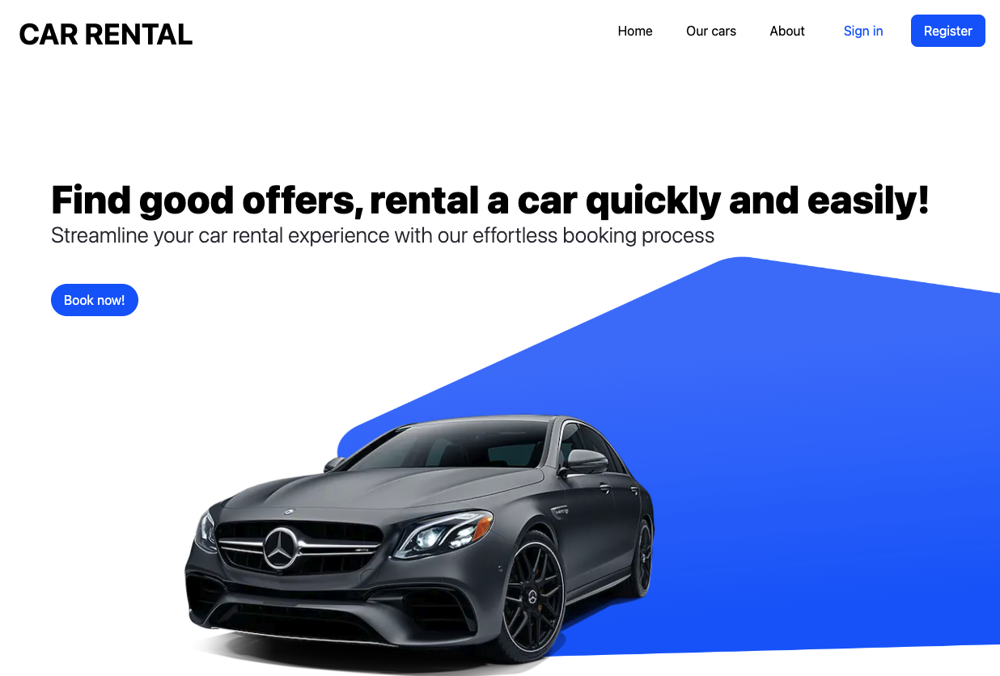

# Car Rental Website

Welcome to the Car Rental Website project, where you can experience a seamless car rental process with our user-friendly mockup. Explore a diverse range of vehicles, easily book your preferred car, and discover transparent pricing, convenient search options, and a responsive design for a smooth online car rental experience.

## Description

The Car Rental Website is designed to provide users with an immersive and intuitive car rental experience. Whether you're looking for a car for your next trip or simply want to explore the options available, our website is here to assist you. This project was created as a showcase and practice exercise to apply what I've learned.

## Usage

- Visit [https://car-rental-dc.vercel.app/](#) to explore our wide range of vehicles and experience the user-friendly booking process.
- Although this is a mockup, you can get a feel for the car rental process and user interface.

## Screenshots

## Support/Contact

If you have any questions, suggestions, or would like to discuss the project, please feel free to contact me via email at [dhamachart.c@gmail.com](mailto:dhamachart.c@gmail.com).

---

Thank you for visiting the Car Rental Website project. Enjoy exploring the world of car rentals!
